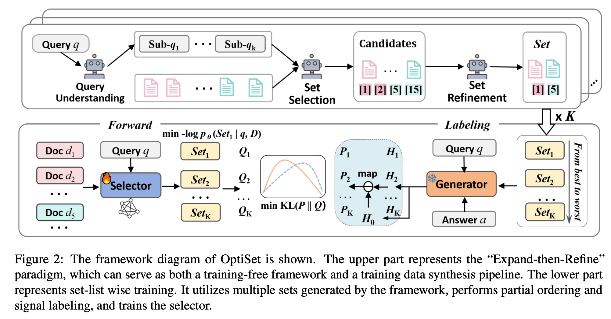

<p align="center">

  <h2 align="center"><strong>OptiSet: Unified Optimizing Set Selection and Ranking for Retrieval-Augmented Generation</strong></h2>

<p align="center">

  <a href="https://arxiv.org/pdf/2601.05027">
    
  </a>
</p>

<div align="center">
</div>

<div align="center">
  <span class="author">
    <a href="https://github.com/liunian-Jay">Yi Jiang</a>, &ensp;
    <a href="https://scholar.google.com/citations?user=ZtIhRvwAAAAJ&hl=zh-CN&oi=sra">Sendong Zhao</a><sup>†</sup>,  &ensp;
    Jianbo Li,  &ensp;
    Bairui Hu,  &ensp;
    Yanrui Du,  &ensp;
    Haochun Wang,  &ensp;
    Bing Qin &ensp;
  </span>
  
  <br>

  <span class="affiliation">
    Harbin Institute of Technology
  </span>

  <br>

  <span class="note">
    <sup>†</sup>Corresponding author
  </span>
</div>

## 🌞 Introduction
> we propose OptiSet, a set-centric framework that unifies set selection and set-level ranking for RAG. OptiSet adopts an "Expand-then-Refine" paradigm: it first expands a query into multiple perspectives to enable a diverse candidate pool and then refines the candidate pool via re-selection to form a compact evidence set. We then devise a self-synthesis strategy without strong LLM supervision to derive preference labels from the set conditional utility changes of the generator, thereby identifying complementary and redundant evidence. Finally, we introduce a set-list wise training strategy that jointly optimizes set selection and set-level ranking, enabling the model to favor compact, high-gain evidence sets.

<div align="center">


**Framework**
</div>

## Details will be completed soon!
...TBD...

## Citation
```bibtex
@misc{jiang2026optisetunifiedoptimizingset,
      title={OptiSet: Unified Optimizing Set Selection and Ranking for Retrieval-Augmented Generation}, 
      author={Yi Jiang and Sendong Zhao and Jianbo Li and Bairui Hu and Yanrui Du and Haochun Wang and Bing Qin},
      year={2026},
      eprint={2601.05027},
      archivePrefix={arXiv},
      primaryClass={cs.AI},
      url={https://arxiv.org/abs/2601.05027}, 
}
```

Thanks for your interest in our work!
